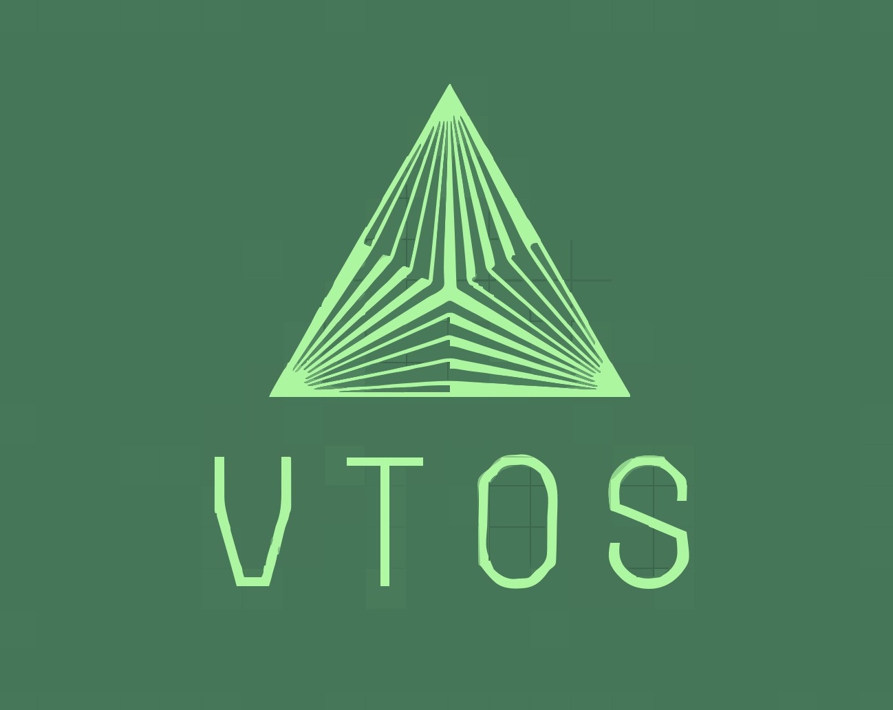

<div align="center">
   
      <!-- <h1>VTOS</h1> -->
</div>


<br>
<h1 align="center"><strong><i>VTOS</i></strong></h1>


<div align="center">
   <a href="https://github.com/Sable-20/VTOS">
      
   </a>
   <a href="https://wakatime.com/badge/user/ea72ab72-e3d9-41de-baf2-b89253f9cca5/project/4bb466bc-384a-4776-8ca2-1b3a326aec6d">
      
   </a>
</div>

## Description

VTOS is a hobby operating system being designed by myself simply because
I think it's fun and it gives me a project. Maybe one day it'll be
usable but for now that intention is just to have fun programming and
give myself a project so that my skills don't get rusty. I do fully
intend one day to try and make it have modules and be able to use Rust
and all those *fancy* things.

## Installation

Requirements to build the project:

* binutils
* xorriso
* x86_64 cross compiler
* git
* a c compiler 
* nasm

*If you want to build documentation:*

* Doxygen 
* Sphinx

**To build the operating system and make an iso**
```bash
# if you are on Mac
./mac.sh 
# other systems
make
```

**To build the documentation**
> [!IMPORTANT]
> Sphinx and Doxygen are required or this will fail
```bash
make docs
```

## Roadmap

Here's a glimpse into the exciting journey ahead for our project:


- [ ] kprint() and serial output 
   - [ ] Use [SSFN](https://wiki.osdev.org/Scalable_Screen_Font) for ease, eventually move to other more advanced options
- [x] Complete using sphinx documentation for clarity
- [ ] Write GDT beyond Limine default 
- [ ] Write and load IDT

> [!NOTE]
> IDT is not provided according to [Limine Boot Protocol Specification](https://github.com/limine-bootloader/limine/blob/trunk/PROTOCOL.md#machine-state-at-entry)

> [!TIP]
> SSFN may not be used, if memory management is completed first PSF will be used instead


- [ ] Terminal Scrolling
- [ ] paging 
- [ ] memory management and use `PSF` fonts 
   - [liballoc](https://github.com/blanham/liballoc/tree/master) used for memory management

> [!TIP]
> We are considering using *jemalloc* instead

- [ ] modules
- [ ] Port Rust and other languages we see necessary

> [!NOTE]
> paging provided by *Limine Boot Protocol*

We're excited about what's coming and will keep you updated as we
progress. Your feedback and support are crucial as we build the future!

Contributors
------------

- [**Sable-20 -- Contributer**](https://github.com/Sable-20>)

A big thank you to everyone who made this project possible!